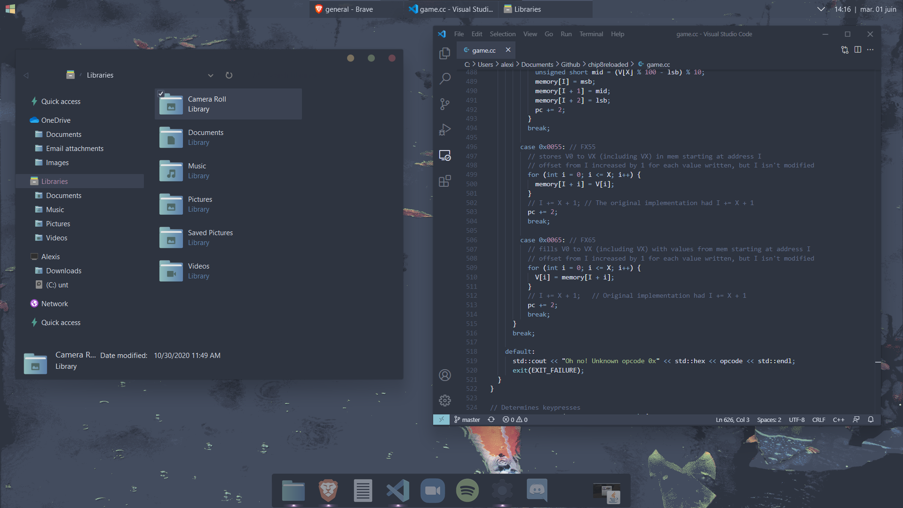
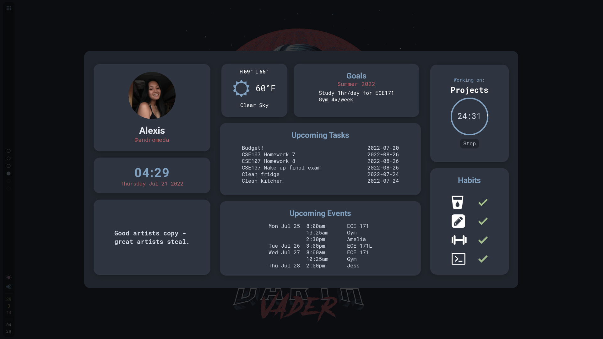
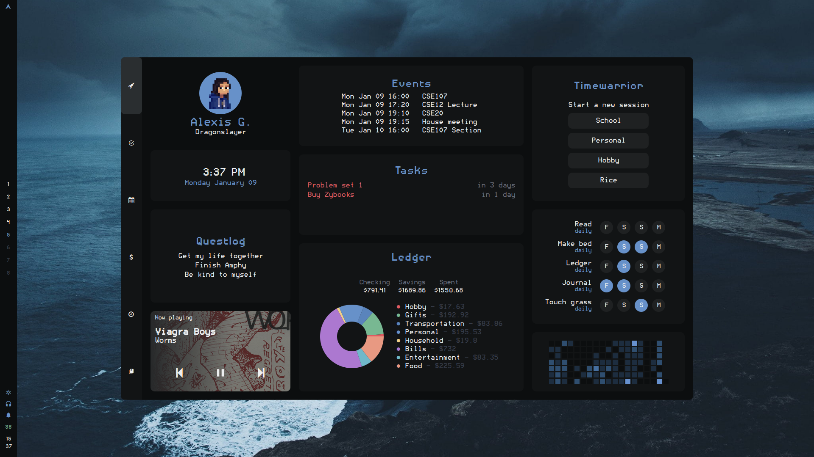
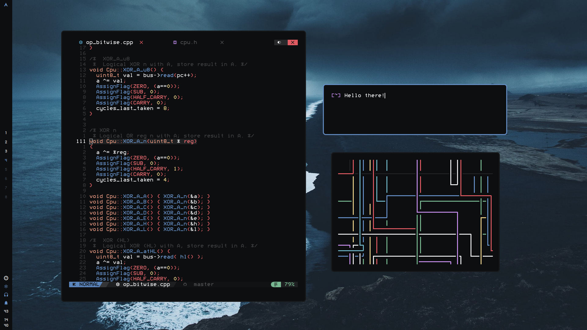

When I have free time, I spend a *lot* of it customizing my desktop. You might think that consists of just cherry-picking some colors and fonts that look nice, but it's so much more than that. It's about using (and borderline abusing) AwesomeWM's API to create perfect tools for a perfect workflow that's tailor-made for me.

AwesomeWM, if you're unfamiliar, is a window manager with a built-in UI framework and is configured in Lua. It's incredibly powerful and there hasn't been a single idea that I couldn't implement with it without enough finagling. It embodies both of my favorite things about coding: one, anything is possible; and two, if something isn't, it's because the right tool hasn't been invented yet.

You can read about my desktop progression below or just [skip to the good stuff.](#the-actual-tour)

### The desktop lore
**Mid 2021.** Once upon a time I used Windows and discovered [r/rainmeter](https://www.reddit.com/r/rainmeter). It blew my mind and I sought out to create the best-looking desktop that I could. That resulted in the following Windows setup.

(Looking back, this is kind of the best-looking one... time to implement this in AWM?)

**Late 2021.** Eventually I decided to take the Linux plunge and jumped straight into Arch/bspwm/Polybar. No pictures of that era unfortunately, but I know retrospectively it looked awful, so there's not much lost.

**Early 2022.** Polybar was an incredible pain to configure, so I migrated to the Eww setup below.

**Mid 2022.** As I got more comfortable with Eww, I also started getting more creative. This was the first iteration of the dashboard. It's... rough.

**Late 2022.** By this point I had become a die-hard nvim user and interacting with the dashboard with my mouse was getting annoying. I couldn't see any easy way to implement keyboard navigation within Eww, so I left for Awesome. I learned Lua, developed the [keynav library](https://www.github.com/garado/awesome-keynav) (invent the tools to make things possible!), and ended up with this.

And that brings us to today.

### The actual tour
#### Dashboard
