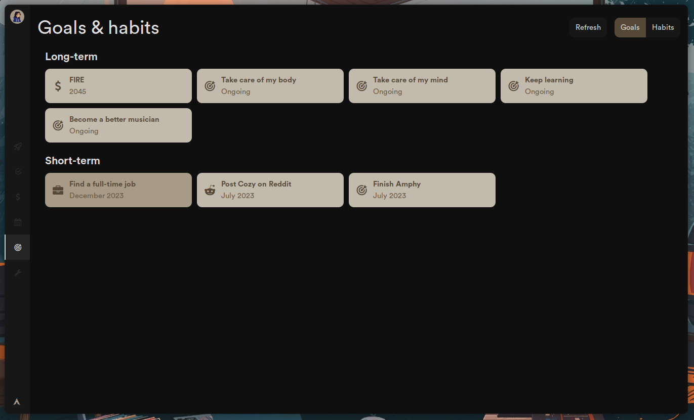
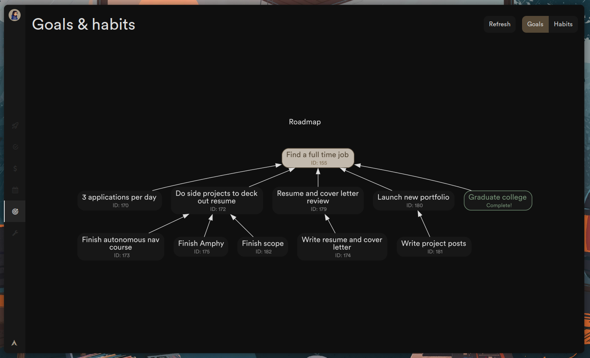
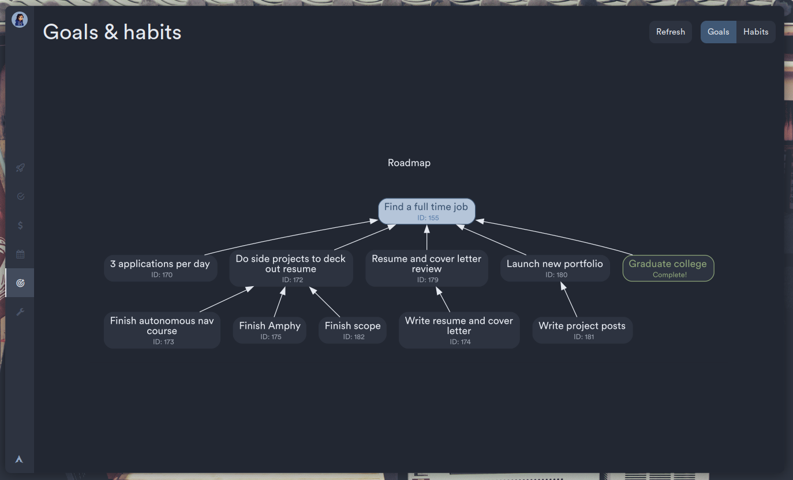

A big part of my dashboard is making tools specifically tailored for my workflow. In this case, I wanted a way to keep track of my goals and view them at a glance. Initially I tried to write my own CLI goals tracking program in Go, but then I realized I could use dependencies in TaskWarrior to do it. I also discovered [twdeps](https://github.com/nerab/twdeps/), which could generate a graph from a set of interdependent tasks using [Graphviz](https://graphviz.org/)!

The only thing twdeps was missing was customization options, so I [added them myself](https://github.com/garado/twdeps). After a few hours of banging my head against the wall I successfully did it. I also found out that Graphviz can't automatically linewrap long node labels for you and you have to manually insert linebreaks in the string (which is crazy to me), so I found some StackOverflow script that did the manual wrapping in Perl and translated it to Ruby (the language twdeps is written in).

Once I was happy with the appearance, I started working on integrating it into my dashboard. That part was fairly easy and I'm really happy with the result.

Here is a list view of goals in my dashboard.

Clicking an item opens an autogenerated roadmap of how I'm going to get there.

And here it is with a different dashboard theme to showcase the new theming capabilities added to twdeps.

I thought about integrating twdeps into my custom-made TaskWarrior frontend, but I don't use dependencies in TaskWarrior often, so I likely won't. Cool thought though.

----

**What I learned**
- I scrapped my custom goals tracker, but in the process found out how unbelievably easy it is to make CLI programs in Go.

**What I'd do differently**
- Not much. It was a small project.
