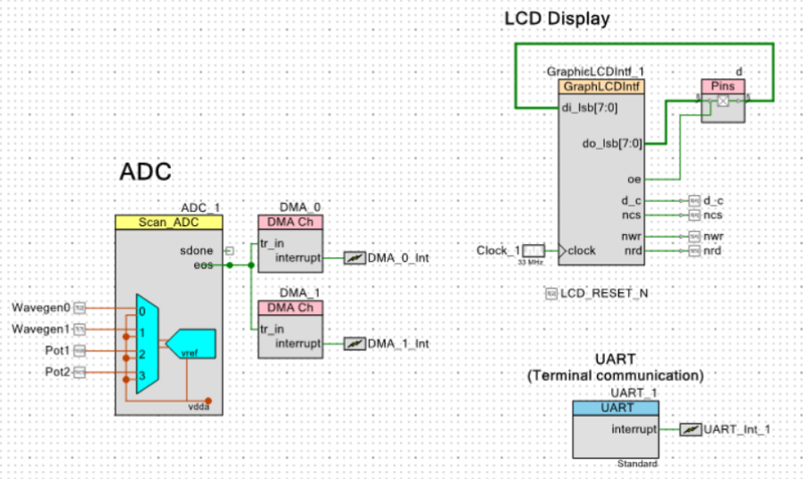
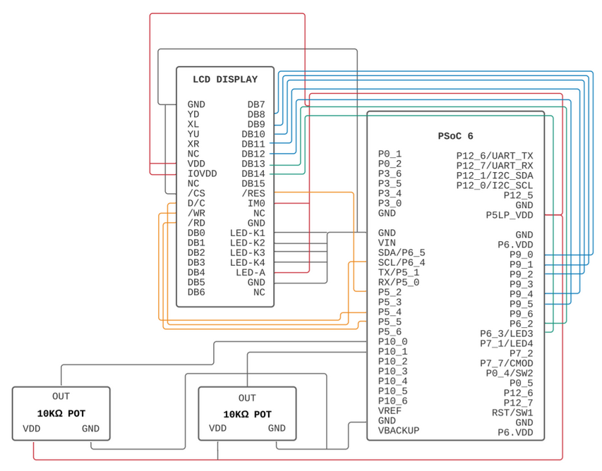
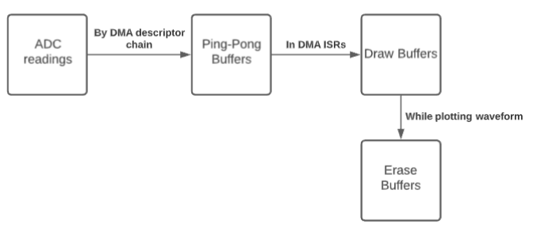
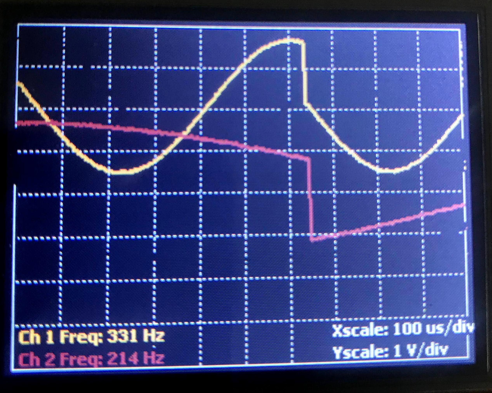
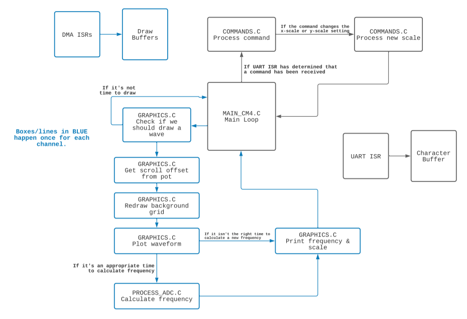
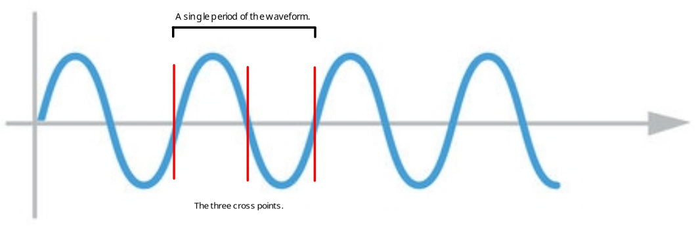

# Overview
The goal of this project was to construct a dual-channel oscilloscope. The TinyScope supports both free-running and trigger modes, with the settings for each mode determined by user-inputted arguments through the command line. It also includes x- and y-scaling functionality to allow for closer examination of the waveforms being displayed, as well as scrolling capabilities using two potentiometers to adjust the waveforms' vertical position on the screen.



## Hardware
The main hardware components used for this project are the onboard ADC, the LCD interface, and UART communication block.

The ADC used on the PSoC-6 has a sampling rate of 1 million samples/second, which for this project gets divided into 4 channels that each sample at a rate of 250 kilosamples/second. Two channels are used for the potentiometers to support scrolling for the waveforms and the other two channels are used for the input waveforms. Next, the LCD interface module is required to correctly communicate with the New Haven 320x240 display used for the project. Lastly, the UART communication block is required for both receiving characters and sending characters to the command line.

## Software
### Design goals
When drafting and organizing my approach for this project, my main goal was readability and simplicity. I attempted to break my design into modular chunks and simply combine everything together as needed within the main loop to make the control flow easier to understand.

### Software organization
My code is split into 5 main sections: graphics, processing DMA data, commands, components, and lastly the main file.

The graphics and processing sections each require their own set of variables, which are declared in a struct inside a header file and are instantiated once for each channel in the main file.

The commands section has its own struct as well, but as it contains variables representing the settings of the TinyScope which are common across all channels, only one struct is needed during the program’s execution.

The component section contains ISR definitions and helper void functions to handle initializing and starting various hardware components.

### Data flow

#### Ping-pong buffers
Several data buffers are used within my design. The first are the two small ping-pong buffers, which are filled with data coming directly from the ADC by repeating DMA descriptors. Only one of these buffers is written to at any given time and when they fill up, the DMA starts filling up the other one (hence the name).

#### Draw buffers
It is not practical to plot data directly with the ping-pong buffers because of the high probability of the data in the ping-pong buffers being overwritten during plotting (data loss). To avoid this, I use separate larger draw buffers for each channel and plot from there. These buffers are filled within the DMA ISRs. The function to fill the draw buffer also keeps track of how much data it has copied, setting a flag when enough data points are ready for plotting.

#### Erase buffers
During plotting, the old waveform needs to be erased and a new one needs to be drawn in its place. The easy way to do this would be to clear the entire rectangular region where the old waveform was drawn, but that made drawing noticeably laggy and caused the screen to flicker. Instead, during plotting, the current line being drawn gets stored into a separate erase buffer, and during the next plot, I redraw the old data stored in the buffer in the same color as the background, effectively erasing the old waveform. This method made drawing significantly faster.

### Overall program flow

#### Main loop
I kept the main file fairly simple in my implementation. Before the main loop begins, I initialize the hardware components and various modules used in my design. After initialization is complete, the main loop begins. I attempted to keep the loop as simple and clean as possible. All it does is wait for certain events to occur and respond to them with the appropriate function call.

#### Processing commands
First, the main loop checks if there is a command that the user has finished entering.

Receiving user input is handled with an interrupt that triggers when the UART’S RX FIFO is not empty, i.e. each time a character is received. In this interrupt, the character is removed from the FIFO and put into a separate array that contains all of the characters received thus far. When the user presses ENTER to submit the command, the carriage return and newline characters will be detected by the ISR, and it can then set a flag indicating that a command is ready to be processed.

When this flag is set, the main loop invokes a function that `strtok`'s the character array using spaces as the delimiters to break the user input up into words. From there, I `strcmp` on each of the words that the user inputs in order to determine what command the user is entering, and I execute the command appropriately. This function ended up being the longest function in my entire program but it was mostly trivial error-checking.

#### Determining whether to draw the waveform
After this is complete, the main loop goes on to check if the conditions required for drawing are met. There are several cases for when this could potentially happen listed below.

1. **The first `start` command has been received.** On startup, TinyScope should show a blank screen with no waveforms being drawn. This case must be true before anything is drawn.

Additionally, at least one of these three cases must be true:

2. **The display is stopped.** Though there is no new data to be drawn in this case, the waveform still needs to be redrawn with the appropriate potentiometer offset.
3. **The draw buffer is full**, and at least one of the following:
    1. Mode is set to trigger, current channel is the trigger channel, the trigger has been found, and the wave hasn't been drawn yet. This plots the trigger waveform.
    2. Mode is set to trigger and current channel is not the trigger channel. Only one channel can be in trigger mode at one time; the other one is in free-running mode.
    3. Mode is set to free-running.
4. **The trigger channel's waveform has been plotted.** This makes sure to redraw the trigger waveform with the appropriate pot offset.

If `(case1 && (case2 || case3 || case4)) == TRUE`, then the main loop knows to draw the waveform. While plotting, TinyScope recalculates the scroll offset from the potentiometers, redraws the grid, plots the waveform, calculates frequency, and reprints the frequency and scale settings.

#### Scroll offset calculations
To determine the correct y-scroll offset, TinyScope uses the current yScale setting, the maximum expected amplitude of the waveform (3300mV), and the ADC reading from the pot.

#### Plotting the waveform
After the scroll offset is calculated, a function takes the data stored in the draw buffer and y-scales it to fit the display screen size and the y-scale setting. Then it plots this value to the display. It contains a loop that iterates through all of the available x coordinates on the screen and plots points at the appropriate locations. The x-scale setting determines the interval between points to be plotted, and the loop simply increments by the x-scale setting to achieve that.

#### Calculating the waveform's frequency
After the waveform drawing is complete, the main loop then moves on to processing the frequency.

To calculate the frequency, a function iterates through the draw buffer and looks points where the waveform crosses a certain threshold. This threshold is half of the difference between the maximum amplitude of the wave and the minimum amplitude of the wave (a.k.a. the “midpoint” of the waveform). During one full period of the wave, three such cross points occur. The difference of the indexes of the first cross point and the third cross point (in general, just two cross points in the same direction) can be used to calculate the period of the waveform, which can then be used to find the frequency of the waveform.

As I iterate through the draw buffer looking for cross points, I also compare values to find the minimum and the maximum values within the buffer in order to determine the threshold value. The draw buffer is large enough to ensure that the worst-case period (i.e. the longest period, which occurs at an x-scale of 100us/division and a frequency of 100Hz) fits into the draw buffer, so I can be certain that my maximum and minimum values for the waveform are accurate. After the loop is complete, I calculate the new threshold based on these values and then use that as the threshold for comparison during the next call to the function.

#### Stabilizing readings at lower frequencies
The readings become incredibly noisy at low frequencies with low x-scale settings. To compensate, I adjust the cross point detection interval based on the x-scale setting. This is the interval between points taken from the draw buffer that are used to detect the cross points. If it's 1, then every point from the draw buffer is used to find the cross. If it's 10, then every 10th point is used.

| x-scale setting | Draw buffer entries per period, best-case (10kHz) | Draw buffer entries per period, worst-case (100Hz) | Index difference between 2 cross points in the same direction, best-case (10kHz) | Index difference between 2 cross points in the same direction, worst-case (100Hz) | Chosen interval |
| ---------       | -------                                           | ------                                             | -----                                                                            | -----                                                                             | -----           |
| 100             | 320                                               | 3200                                               | 160                                                                              | 1600                                                                              | 100             |
| 200             | 160                                               | 1600                                               | 80                                                                               | 800                                                                               | 10              |
| 500             | 64                                                | 640                                                | 32                                                                               | 320                                                                               | 1               |
| 1000            | 32                                                | 320                                                | 16                                                                               | 160                                                                               | 1               |
| 2000            | 16                                                | 160                                                | 8                                                                                | 80                                                                                | 1               |
| 5000            | 6.4                                               | 64                                                 | 3.2                                                                              | 32                                                                                | 1               |
| 10000           | 3.2                                               | 32                                                 | 1.6                                                                              | 16                                                                                | 1               |

This allowed my frequency calculations to become extremely accurate regardless of the x-scale setting or the actual frequency used. I was proud of this :)

# Testing
While working on this project, incremental design was key. I rigorously tested each step before moving on to the next in order to isolate the source of any errors.

The parts that I completed and tested in order were:
- Frequency calculations 
- Free-running waveform for channel one
- Free-running waveform for channel Two
- x- and y-scaling
- Scrolling
- Trigger detection
- Frequency calculations (improved)

I used `ifdef`s in order to quickly enable and disable certain channels to make the debugging process faster. I also heavily relied on the built-in debugger in PSoC Creator to narrow down the sources of bugs.

Additionally, I created branches every time I wanted to implement a new feature and merged the branch into the master branch when I was done. This made version control much easier and made it simpler to roll back to previous versions in case my implementation of a feature went horribly wrong (which it often did).

# Conclusion
## Lessons learned
This project taught me the importance of thorough planning. I spent the first week drafting my design and trying to really understand how things would connect within the system, and I think it was extremely beneficial. On a less technical note, this project also taught me the importance of tenacity. Computer engineering is difficult and this project was difficult. Dealing with the loss of random data for no apparent reason and frequency calculations was at times incredibly frustrating, but I am happy that I kept going and finished my TinyScope.
