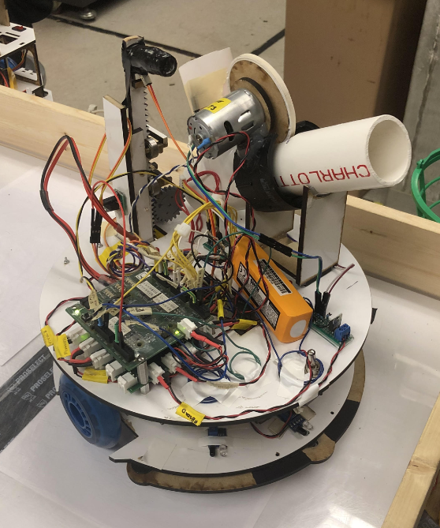
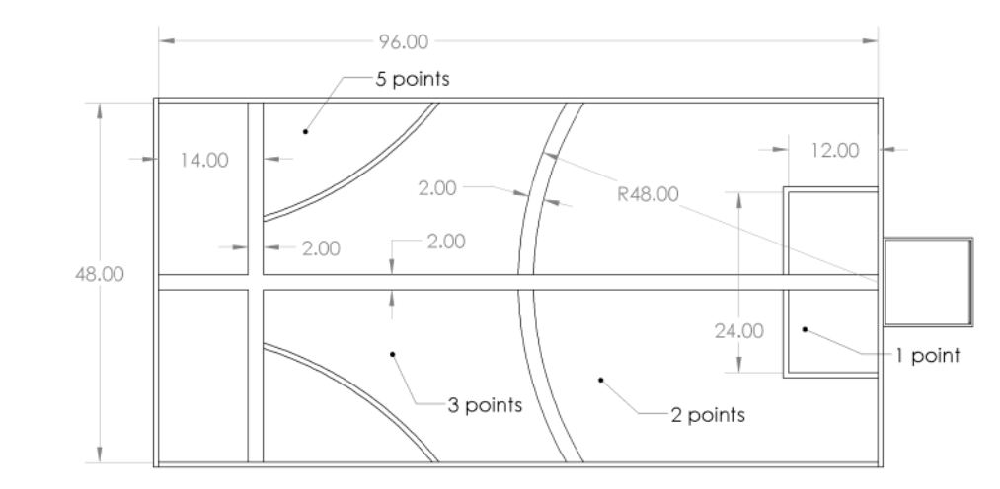
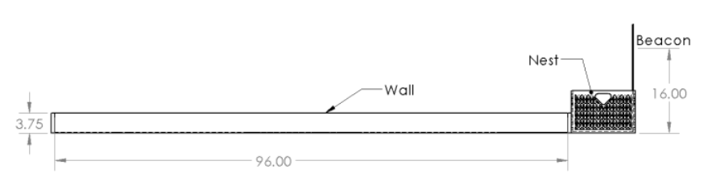
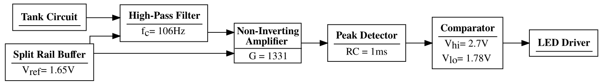
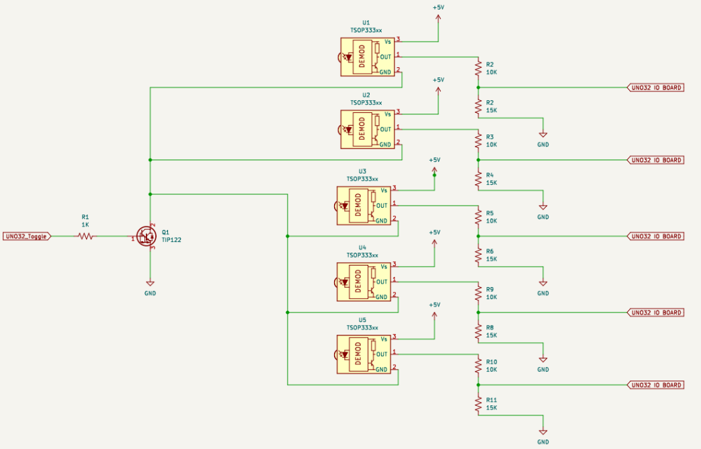
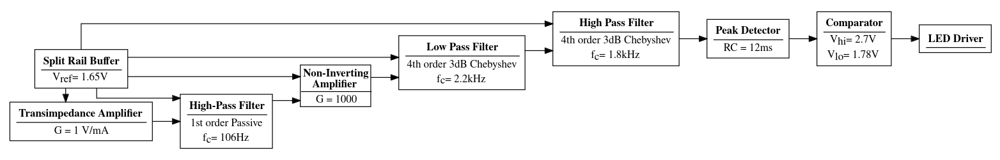
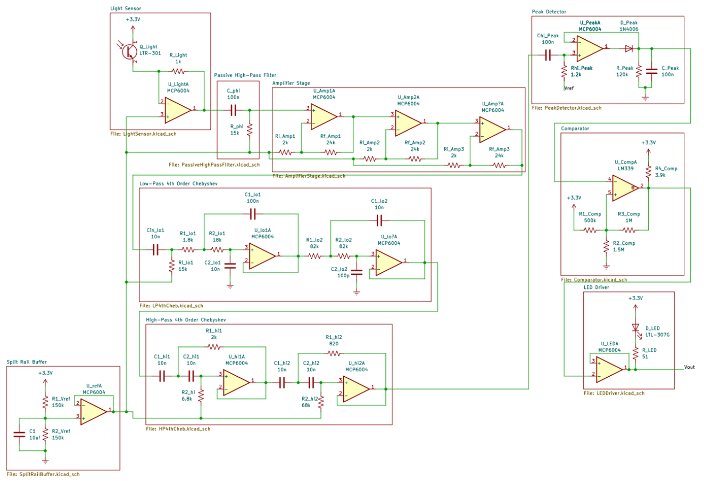
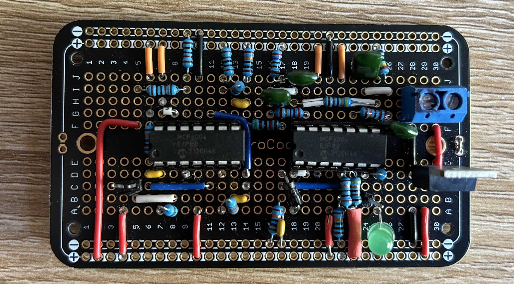
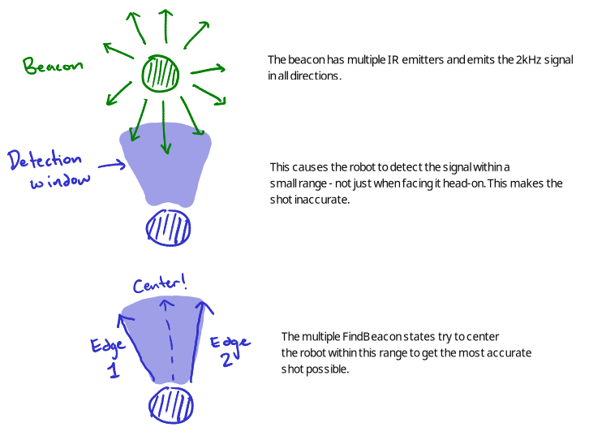

# Overview
This was my final project for ECE118 - Intro to Mechatronics at UCSC, completed in collaboration with [Matt Kaltman](https://www.linkedin.com/in/matthew-kaltman-41a46824b/) and [Neili Hu](https://www.linkedin.com/in/neili-hu-996002231/).

My team and I created an autonomous robot called the Money Machine capable of firing a ping-pong ball at a target marked by a beacon emitting a 2kHz infrared signal. Each successful shot into the target could earn one, three, or five points depending on where the shot was made from, with the different point zones within the arena delineated by wires carrying an oscillating current. There would be an obstacle placed in a random position within the arena and the robot was allowed to carry a maximum of three ping-pong balls at a time with reloads only permitted in a designated zone at the far left of the arena. Lastly, we had two minutes to score ten points.

Due to the two-minute time constraint, our approach was to rely on rapid-fire long-range shots. Our robot navigated toward one of the 5-point zones, fired the balls, and then turned around to find the reload zone - rinse and repeat.

## A summary of our robot
- Analog filter to detect the 2kHz beacon
- 2 track wire detectors for localization
- 5 infrared sensors, 2 bump sensors for obstacle avoidance
- 2 wheels + 2 DC motors controlled with H-bridge
- Flywheel-style ping-pong ball launcher made from PVC pipe, DC motor, and a solenoid
- Beam break sensor to detect reload completion
- LED light strips for swag

# Electrical
### Track wire detector
The track wire used to delineate the different point zones carries a current oscillating at 24-26 kHz. This generates an oscillating magnetic field around the wire. If you put a coil of wire in this field with the right orientation, the coil will experience an oscillating EMF at the same frequency, which can be detected as a voltage.

We use a solenoid to detect the track wire and pass its output through a high-pass filter to isolate the signal. The output of this goes to an ADC pin.

### Infrared sensors
We added five infrared distance sensors mounted on the front and sides of our robot to help with obstacle avoidance. To conserve power, all IR sensors are hooked up to a TIP122 transistor that acts as a power switch so the sensors can be deactivated when the robot isn't actively navigating.

### Bump sensors
As shown in the video above, the IR sensors work quite well for detecting walls. They unfortunately don't work for detecting the obstacle on the field because the obstacle is made of black foam that absorbs the infrared light. To get around that, we also included two bump sensors on the front right and front left of the robot.

### Beacon detector
The beacon detector is the most important sensor on the robot because it locates the target. The detector consists of a phototransistor to receive the 2kHz IR signal emitted by the beacon and an analog filter to isolate the signal.

To get a usable signal out of the phototransistor, we needed a few gain stages to amplify the phototransistor's output. The amplified output is then sent to a 4th order Chebyshev bandpass made of two cascaded lowpass and highpass filters. Then we added the usual stuff (peak detector, comparator) to turn the output into a clean digital signal and routed it to a pin on the Uno.

The result was a pretty good detector that could pick up a signal 15 feet away! The minimum requirement was 8 feet (the length of the arena).

### Reload sensor
Once in the reload zone, we needed a way to detect when the robot was fully loaded with all 3 ping-pong balls. One option would have been to simply set a short timer, but we wanted to be more efficient because of the time constraint. We placed a beam break made from 2 IR sensors at the height of the 3rd ball and if it stayed tripped for 0.5 seconds, it detected a full reload.

# Software
We were required to use an event-driven framework provided by the course staff to implement the software.

#### What the framework does for me
- Creation, manipulation, and monitoring of event queues
- Regular execution of event-checking (polling) routines to detect non-interrupt generated events
- Execution of service functions to process events

#### What I did
- Define events and write event checking functions
- Write service functions to respond appropriately to events
- State machine implementation and overall system design
- Determine what hardware to use, source the parts, and write drivers for everything

## Drivers and event checkers
### Motor control
To move the motors, we used an H-bridge. Each motor took a direction and a  

### Trackwire
The track wire sensor gave an analog reading.

### Flywheel
### Beacon

## Hierarchical state machine overview

stateDiagram
    direction LR
    [*] --> Navigate
    Navigate --> Shoot
    Shoot --> Return
    Return --> Reload
    Reload --> Navigate

    state Navigate {
      [*] --> Orient
      Orient --> ArcForwards
    }
    
    state Shoot {
      [*] --> FindBeacon
      FindBeacon --> FindBeaconEdge1
      FindBeaconEdge1 --> FindBeaconEdge2
      FindBeaconEdge2 --> Center
      Center --> Ramp
      Ramp --> Dispense
      Dispense --> Ramp
    }

    state Return {
      [*] --> TurnAround
      TurnAround --> DriveForwards
    }


#### Navigate
Responsible for navigating to the 5-point zone. During `Orient` the robot slowly turns until the beacon is found, then it arcs forwards trying to find the 5-point zone. It moves to the `Shoot` state on the rising edge of the track wire sensor signal.

#### Shoot
Responsible for aiming and firing the ping-pong balls.

#### Return
This state tries to bring the robot back to the reload zone by turning around and driving forwards, avoiding obstacles along the way. We start reloading the robot once it's made its way into the reload zone.

#### Reload
In this state, the robot waits for the reload sensor to stay tripped for a certain amount of time, signifying that it's fully loaded.



## Obstacle avoidance
I didn't think obstacle avoidance would be so 



# Other stuff
In addition to being the software lead, I also maintained documentation for the team to help keep us organized, on track, and aware of each others' progress.

# Retrospective
Since it was an open-ended project, we initially threw around a lot of ideas for how to accomplish the task. It took a very long time for us to settle on a final design, leaving little time for our final design. I wasted a week fighting with ultrasonic sensors only to scrap them because gave such unreliable readings. I also wasted time on a gyroscope.

Should've gotten a high current H-bridge so shooting didn't take so long. We also should've spent more time designing a shield for the beacon detector to improve the robot's accuracy.

We ended up placing third in the class competition behind one student team and one team comprised of course alumni who were given a day to build their bot. Not too bad!
