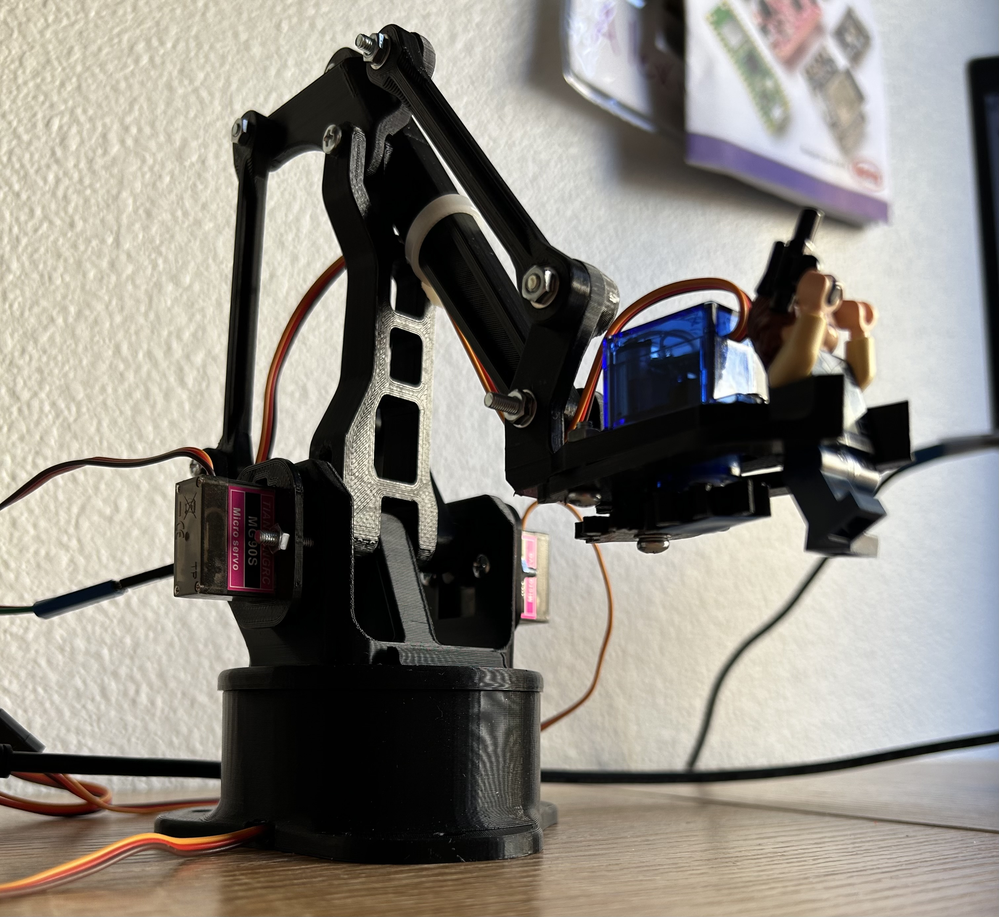

# Overview
I spent a couple days making a micro servo robotic arm controlled by two joysticks. I used [this STL from Thingiverse](https://www.thingiverse.com/thing:1015238). The code is written in C using FreeRTOS and runs on an ESP32.



# Development
I started with setting up the joysticks. Each joystick has two outputs: one for the x direction and one for the y direction. I used a voltage divider to scale the 0-5V outputs to the 0-3.3V required by the ESP32 input pins and read the voltage with the ADC.

Servos are controlled using a PWM signal with the angle determined by signal's duty cycle. The ESP32 has a dedicated servo PWM library, but it was difficult to understand how to use it with more than one servo. I ended up using the LED control library instead to generate the control signals.

A voltage from the joystick above a certain threshold increased the PWM duty cycle and vice versa. Moving the first joystick up and down adjusted the servo controlling the claw and moving it side to side adjust the servo controlling the arm's rotation. The second joystick is responsible for the arm's vertical and horizontal movement.

The code uses two tasks. One is triggered by a callback when the ADC is done converting, and uses the voltage reading to determine if each of the servo angles should be adjusted. The other one adjusts the duty cycles accordingly and then outputs the PWM signal.



# Difficulties
Things started going wrong once I added the PWM outputs for the vertical and horizontal servos - every single one started moving unpredictably. I poked around with an oscope and I noticed that the supply voltage was not the constant 5V that I expected. I could see traces of the PWM signals on it.

Although each servo can technically move 180 degrees, there's a mechanical limitation when you put them all together in the robot arm. For example, with the way the claw is constructed, the claw servo physically can't move more than 45 degrees. Trying to set the servo angle to something out of range causes the motor to stall. This makes it  draw a lot of current, causing so much noise on the supply line that the ADC starts reading false movement in the joystick. The end result is this jittery mess:



To fix it, I had to experimentally determine the minimum and maximum duty cyles for each servo and ensure that the duty cycles always stayed within that range.

# Conclusion
This was a pretty fun and rewarding robotics project! Eventually I want to experiment with inverse kinematics, but for now I'm happy with it. 

# Resources and links
- [Code](https://github.com/garado/tinyprojects/tree/main/arm)
- [.stl](https://www.thingiverse.com/thing:1015238)
