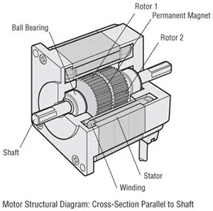
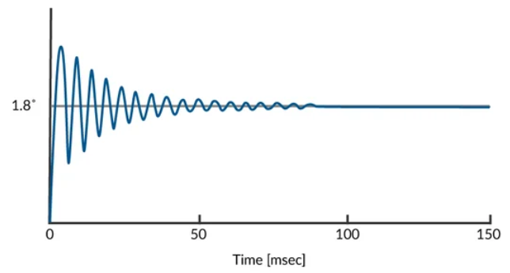
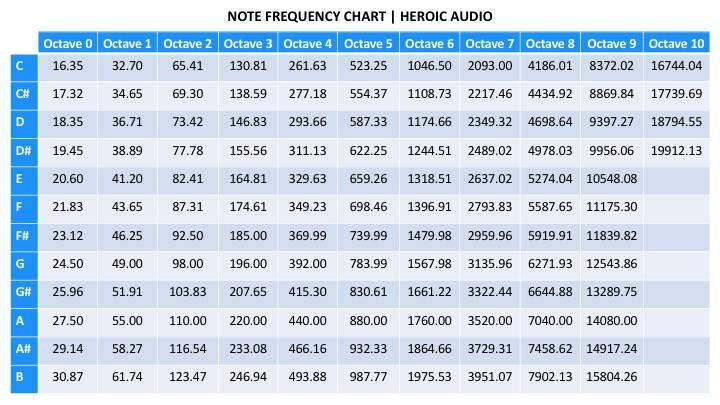

# Overview
For this project, I've programmed an array of stepper motors to play music from a Midi file. The code is written in C and runs on an ESP32. This gave me a chance to combine my two favorite hobbies: programming and music. Super fun!



&nbsp;



&nbsp;



## What's a stepper motor and why can it make sounds?
A stepper motor is an electrical motor that rotates in a series of small steps instead of continuously. It is made up primarily of two parts: a stator and a rotor.



The rotor is the spinny part of the stepper motor. It's like a bar magnet that interacts with the magnetic fields generated by the stators.

Below is an example of a full-step drive stepper motor




## Playing notes with the stepper motors
I used [Nema 17 stepper motors](https://www.amazon.com/Stepper-Motor-Bipolar-64oz-Printer/dp/B00PNEQI7W) with [A4988](https://www.amazon.com/dp/B07BND65C8?ref=nb_sb_ss_w_as-reorder-t1_k1_1_5&amp=&crid=11NV3J54TX0P5&amp=&sprefix=a4988) stepper driver boards. The driver boards let me control the stepper motor with a PWM signal from just one pin on the ESP32. This was very nice - prior to getting the driver boards, I was connecting the four pins of the stepper motor to the ESP32 directly and controlling each pin within a full step drive state machine. It sucked. (And I ran out of pins really fast.)

To play a note with a stepper motor, you adjust the frequency of the PWM signal to match the note you want and it will vibrate at that frequency, producing a sound. Its duty cycle doesn't matter. Below are all the frequencies corresponding to each note.



The main part of this project is generating multiple stable PWM signals with the ESP32. Here's a quick summary of what my options were:

- LED control unit has 16 PWM channels but only supports 4 different integer frequencies. This means you are limited to 4 notes at a time and some of the notes (lower ones, mainly) might be pitchy.
- The 2 motor control PWM (mcpwm) units have 3 pairs of PWM outputs each, but the maximum frequency is 2kHz.
- There are 4 hardware timers which you can define callbacks for. You can implement software PWM using these and get a theoretically pitch-perfect note, but it's very inefficient for the frequency range that this application requires.

I did software PWM first because I wanted things to be pitch-perfect, but that didn't work out very well - the poor little ESP32 couldn't execute all the callbacks fast enough and it sounded like a garbled mess. Then I switched to using LEDC since I don't have that many steppers anyways. I ended up not noticing anything wrong with the pitch.

## Parsing the Midi file
I used [abique's midi library](https://github.com/abique/midi-parser). It reads the file and maps it to memory with `mmap()`, but reading files on ESP32 takes an irritating amount of setup, so I just convert the Midi files to a byte array in a header file with `xxd --include` and patched the library a little to accomodate that. I wrote a simple bash script to do the conversion and compilation automatically.

## Keeping time
Midi files consist of a stream of events in chronological order. Each event consists of the following:
- event type (i.e. `NOTE_ON`, `NOTE_OFF`)
- $\Delta$t (time until the event happens in Midi ticks)
- other parameters depending on the event type
  - `NOTE_ON` has the note number (0 to 127, corresponding to C-2 to G8) and velocity (loudness) as parameters
  - `NOTE_OFF` has the note number as a parameter

A Midi tick is a length of time whose duration is defined by the time division (aka time signature) and tempo of the piece. The time division is given in Midi ticks per quarter note and the tempo is given in microseconds per quarter note. Using this information, you can calculate how many microseconds there are in one Midi tick.

$$
\frac{\mu\text{sec}}{\text{qtr note}} * \frac{\text{qtr note}}{\text{Midi ticks}} = \frac{\mu\text{sec}}{\text{Midi ticks}}
$$

To keep time, I find the delta time til the next event, then I execute the current event and delay for that delta time. Then I move on to the next event - rinse and repeat.

```
while events remaining:
  this_event = get_next_event()
  
  if it's the first event:
    last_event = this_event
    continue
    
  handle_last_event()

  usec_til_next_event = this_event->delta_time * usec_conversion_factor

  last_event = this_event

  delay_us(usec_til_next_event)

```

## Conclusion
Very fun project that I hope to extend in the future!
