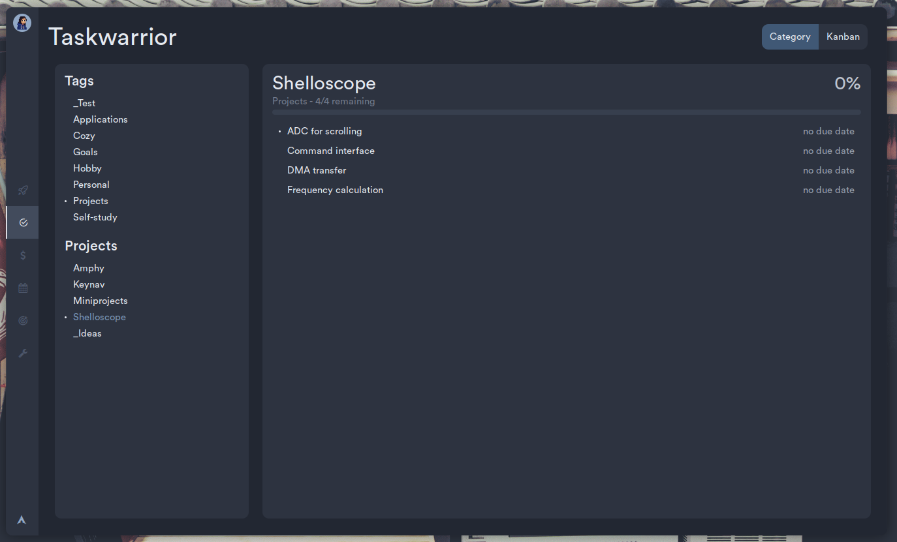

This is my little passion project. Something else I'm also really into is design.

### Task manager

TaskWarrior is a great way to manage my to do list. However, using it on the commandline feels clunky and all the TUIs for it feel even clunkier, so I wrote my own frontend tailored specifically to my needs.

### Calendar
A frontend for gcalcli.

### Goals
Using TaskWarrior and twdeps, I can autogenerate 
